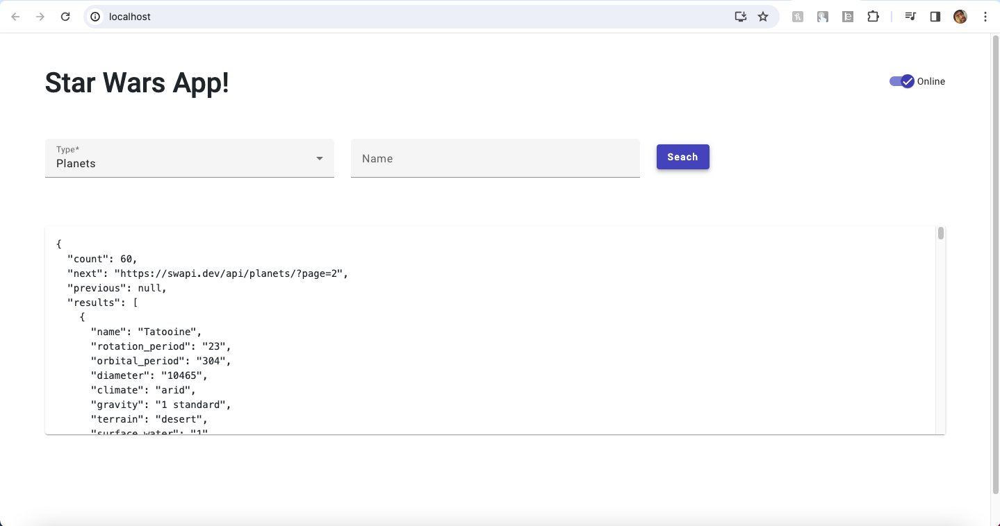
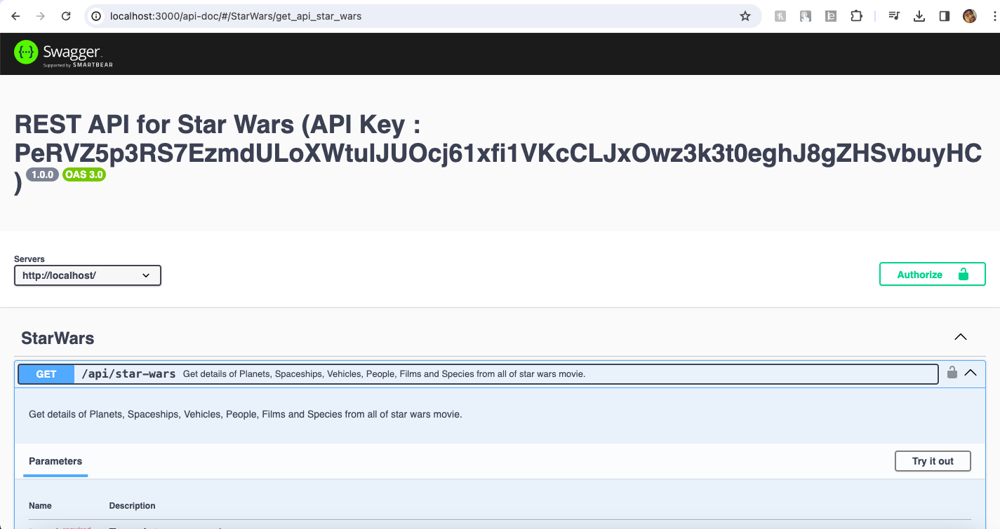
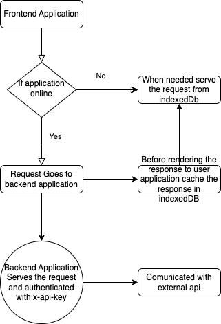

# Design Patter for start wars application
- For Backend Development Module Design Pattern is used for managing application functionality
- Backend Comunicate with third party apis (https://swapi.dev/)
- API's are authenticated with x-api-key for authorization
- For Frontend application stand alone component with progressive web / service worker suppoer is added
- For offline support from UI indexedDb is used to store api response when application is online and when offline system is serves the response from the stored data.

### Swagger Implementation (http://localhost:3000/api-doc/)
## Local Build and Setup


```bash
docker compose up
```
    
## API Reference

#### Get Tree Node

```http
  GET /api/star-wars
```
## Build and Deployment

To run via docker

```bash
  pipeline {
  agent any
  stages {
    stage('Build Backend') {
      parallel {
        stage('Build Backend') {
          steps {
            sh '''cd star-wars-backend
echo "
PORT=3000
API_TOKEN=PeRVZ5p3RS7EzmdULoXWtulJUOcj61xfi1VKcCLJxOwz3k3t0eghJ8gZHSvbuyHC
NODE_ENV=production
" > .env'''
            sh 'ls -al'
            sh 'docker build ./star-wars-backend -t star-wars-backend/v1'
          }
        }

        stage('Build Frontend') {
          steps {
            sh 'docker build ./star-wars-frontend -t star-wars-frontend/v1'
          }
        }

      }
    }

    stage('Docker Images') {
      steps {
        sh 'docker images'
      }
    }

  }
}
```

### Screen Shoots





### Flow Chart


